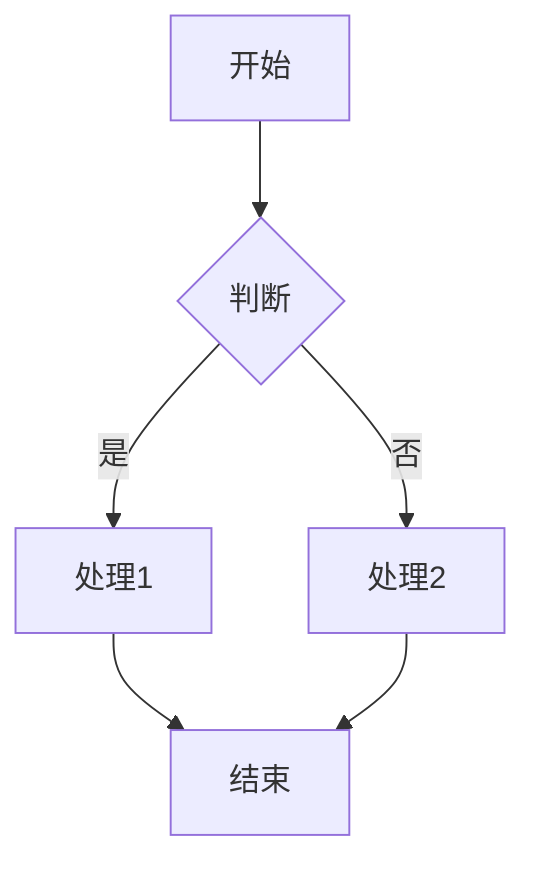

# 流程图制作（Mermaid）

> 使用文本语法创建流程图

## 功能特性

- **Mermaid 语法** - 简洁的流程图描述语言
- **实时预览** - 所见即所得
- **导出** - 导出 SVG/PNG 图片

## 快速开始

1. 输入 Mermaid 语法
2. 实时预览流程图
3. 调整样式
4. 导出图片

## Mermaid 语法示例

## 常见图表类型

- **流程图** - `graph` / `flowchart`
- **序列图** - `sequenceDiagram`
- **类图** - `classDiagram`
- **状态图** - `stateDiagram`

## 常见问题

**Q: Mermaid 难学吗？**
A: 语法简单，上手快，适合技术人员。

**Q: 可以导出什么格式？**
A: 支持导出 SVG 和 PNG 格式。

**Q: 有语法错误怎么办？**
A: 工具会提示错误位置和原因。
